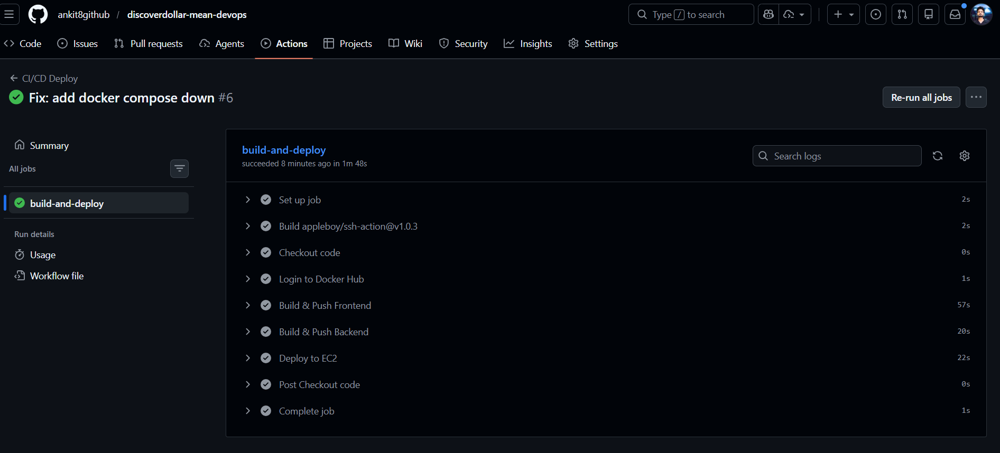
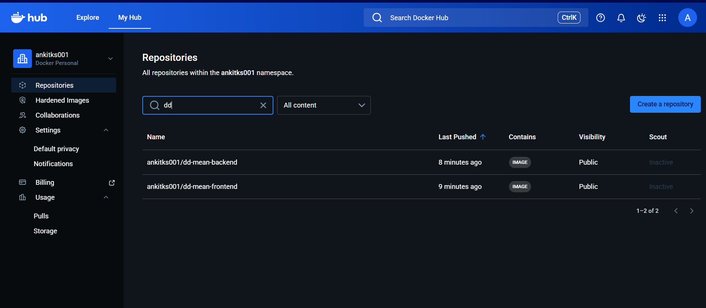
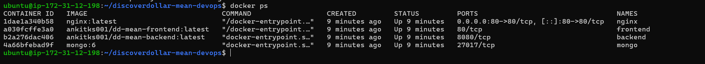
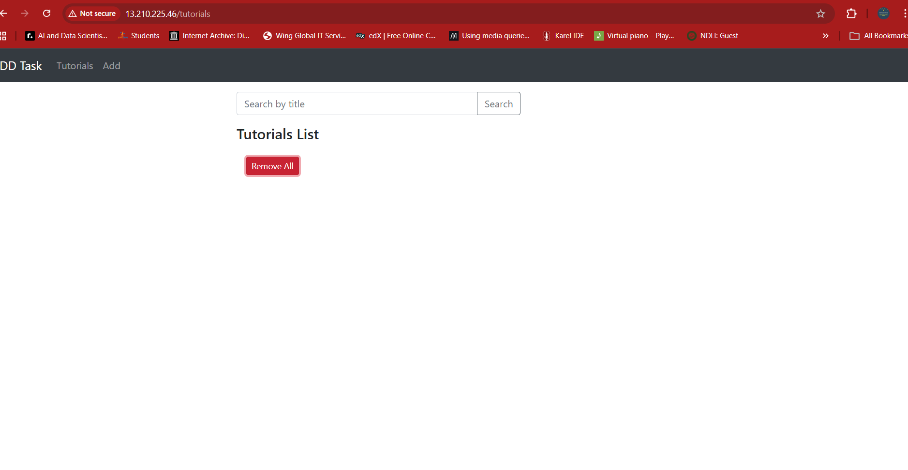
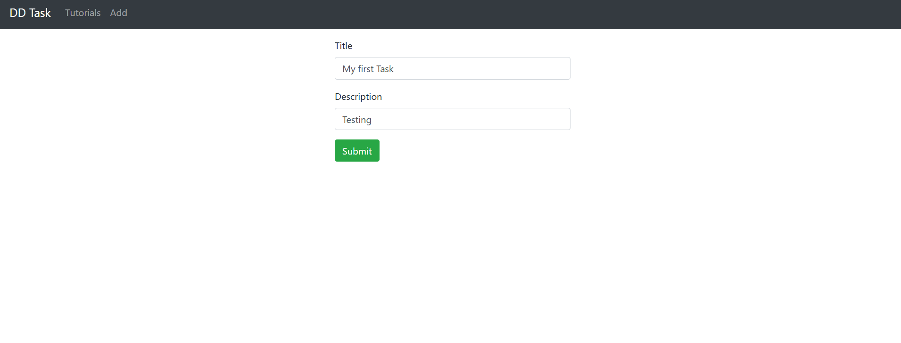
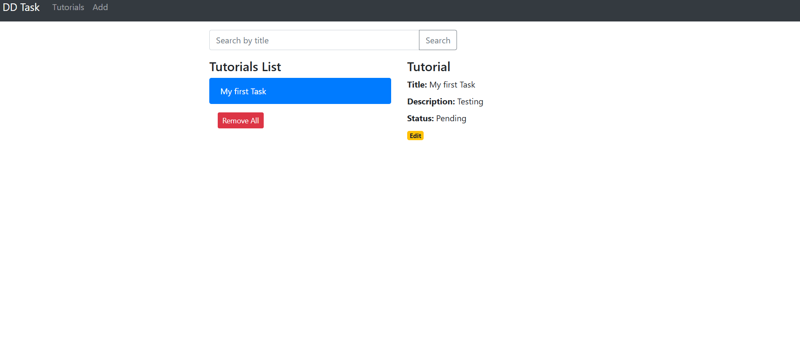
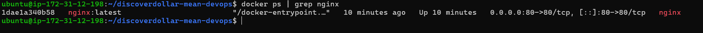

# 🚀 Discover Dollar – MEAN Stack DevOps Deployment

## 📌 Project Overview

This project demonstrates a complete DevOps implementation for deploying a full-stack **MEAN (MongoDB, Express, Angular 15, Node.js)** CRUD application on a cloud infrastructure with CI/CD automation.

The application allows users to:

* Create tutorials
* Retrieve tutorials
* Update tutorials
* Delete tutorials
* Search tutorials by title

The primary objective of application was to:

* Containerize the application
* Deploy it on a cloud-based Ubuntu VM
* Configure Nginx reverse proxy
* Implement CI/CD using GitHub Actions
* Automate Docker image builds and deployments

---

# 🏗️ Architecture Overview

```
User (Browser)
      ↓
Nginx (Port 80 - Reverse Proxy)
      ↓
Frontend (Angular - Docker)
      ↓
Backend (Node.js + Express - Docker)
      ↓
MongoDB (Docker Volume Persistence)
```

---

# 🛠️ Tech Stack

| Layer            | Technology             |
| ---------------- | ---------------------- |
| Frontend         | Angular 15             |
| Backend          | Node.js + Express      |
| Database         | MongoDB                |
| Reverse Proxy    | Nginx                  |
| Containerization | Docker                 |
| Orchestration    | Docker Compose (v2)    |
| CI/CD            | GitHub Actions         |
| Cloud            | AWS EC2 (Ubuntu 24.04) |
| Image Registry   | Docker Hub             |

---

# 📦 Repository Structure

```
discoverdollar-mean-devops/
│
├── backend/
│   ├── Dockerfile
│   └── Node.js API
│
├── frontend/
│   ├── Dockerfile
│   └── Angular App
│
├── docker-compose.yml
├── nginx.conf
└── .github/workflows/deploy.yml
```

---

# 🐳 Docker Implementation

## Backend Dockerfile

* Based on `node:18-alpine`
* Installs dependencies
* Exposes port 8080

## Frontend Dockerfile

* Multi-stage build
* Builds Angular app
* Uses `nginx:alpine` for production serving

## MongoDB

* Official `mongo:6` image
* Data persistence via Docker volume

---

# ⚙️ Docker Compose Configuration

Services:

* MongoDB
* Backend
* Frontend
* Nginx (Reverse Proxy on Port 80)

Deployment command:

```bash
docker compose up -d
```

---

# 🌐 Nginx Reverse Proxy

* Exposes application via port **80**
* Routes:

  * `/` → Angular frontend
  * `/api/` → Backend service

This ensures:

* Clean production-style architecture
* No direct exposure of backend ports

---

# ☁️ Cloud Deployment (AWS EC2)

* Ubuntu 24.04 LTS VM
* Docker Engine installed
* Docker Compose v2 installed
* Security group configured:

  * Port 80 open
  * SSH (22) open

Application accessible via:

```
 http://13.210.225.46
```

---

# 🔁 CI/CD Pipeline (GitHub Actions)

CI/CD Workflow Location:

```
.github/workflows/deploy.yml
```

### Pipeline Triggers:

* On push to `main` branch

### Pipeline Steps:

1. Checkout repository
2. Login to Docker Hub
3. Build frontend image
4. Push frontend image
5. Build backend image
6. Push backend image
7. SSH into EC2
8. Pull latest images
9. Restart containers

Deployment command used in pipeline:

```bash
docker compose down
docker compose pull
docker compose up -d --force-recreate
```

---

# 🔐 GitHub Secrets Used

* `DOCKER_USERNAME`
* `DOCKER_PASSWORD`
* `EC2_HOST`
* `EC2_USER`
* `EC2_SSH_KEY`

All sensitive credentials are securely stored using GitHub repository secrets.

---

# 📸 Screenshots Included

✔ GitHub Actions successful pipeline  


✔ Docker Hub latest images  


✔ EC2 running containers  


✔ Working application UI  




✔ Nginx running container  



---

# 🧪 Local Development Setup

### Backend

```bash
cd backend
npm install
node server.js
```

### Frontend

```bash
cd frontend
npm install
ng serve --port 8081
```

---

# 🐳 Local Docker Setup

```bash
docker compose up -d
```

Access:

```
http://localhost
```

---

# 📈 Key DevOps Highlights

* Multi-stage Docker builds
* Production-ready Nginx configuration
* Docker Compose v2 orchestration
* Automated CI/CD deployment
* Secure credential handling
* Container-based MongoDB persistence
* Zero-downtime image redeployment

---

# 🎯 Completion Status

| Requirement           | Status      |
| --------------------- | ----------- |
| Dockerization         | ✅ Completed |
| Docker Hub Image Push | ✅ Completed |
| EC2 Deployment        | ✅ Completed |
| MongoDB Setup         | ✅ Completed |
| Nginx Reverse Proxy   | ✅ Completed |
| CI/CD Automation      | ✅ Completed |
| Documentation         | ✅ Completed |

---

# 👨‍💻 Author

Ankit Kashyap
DevOps & AI Engineering Enthusiast

---

# 🚀 Final Result

A fully automated, production-ready MEAN stack application deployed on AWS with CI/CD and reverse proxy configuration.

---
